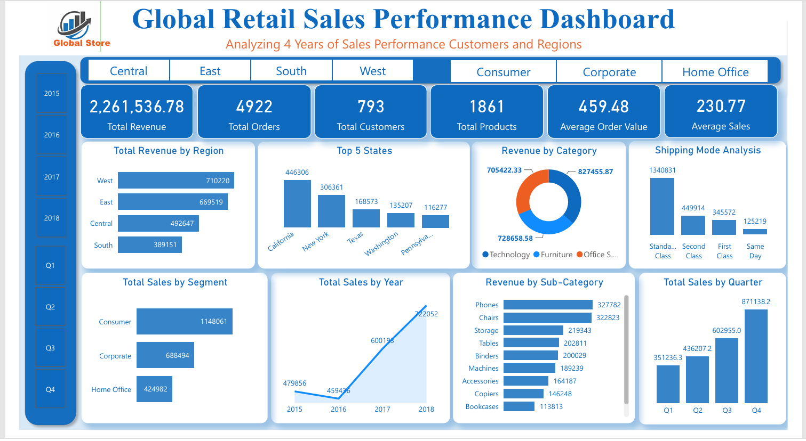
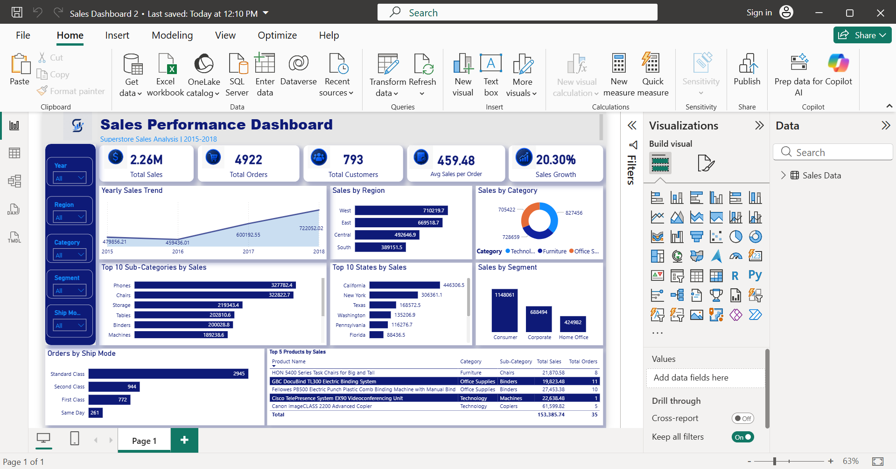

# Sales Performance Dashboard

## Project Overview

This project analyzes sales performance data using Excel, SQL, and Power BI. The goal of the project is to understand revenue performance, customer behavior, regional sales trends, product category performance, shipping mode performance, and overall business growth.

The project includes raw data, cleaned data, SQL queries, Power BI dashboard files, and dashboard screenshots.

## Project Objective

The main objective of this project is to transform raw sales data into meaningful business insights that can support better decision-making.

This analysis focuses on:

* Total revenue
* Total orders
* Total customers
* Average order value
* Sales growth
* Sales by region
* Sales by category
* Sales by customer segment
* Sales by shipping mode
* Yearly and quarterly sales trends

## Tools Used

* Microsoft Excel
* SQL
* Power BI
* Power Query
* DAX

## Data Cleaning Process

The raw dataset was cleaned and prepared before analysis. The cleaning process included:

* Standardizing the Order Date column
* Standardizing the Ship Date column
* Creating a Year column
* Creating a Quarter column
* Preparing the dataset for SQL analysis and Power BI dashboard development

## Dashboard Preview

### Dashboard Design 1

### Dashboard Design 2

Full Analytical Report

A detailed report covering the data-cleaning process, SQL analysis, Power BI dashboard findings, sales performance insights, business recommendations, and SQL result evidence is available below:

[View the Full Sales Performance Analysis Report](report/sales_performance_analysis_report.pdf)

## Key Insights

* Total revenue generated was approximately 2.26M.
* The dashboard analyzed 4,922 total orders.
* The dataset contained 793 customers.
* The West region generated the highest revenue.
* Consumer segment contributed the highest sales compared to Corporate and Home Office segments.
* Technology, Furniture, and Office Supplies were the major product categories analyzed.
* Sales performance improved across the years, with strong growth visible in later periods.
* Standard Class was the most used shipping mode.

## Project Files

| Folder | File | Description |
|---|---|---|
| `data/raw/` | [raw_sales_data.csv](data/raw/raw_sales_data.csv) | Original raw sales dataset before cleaning |
| `data/cleaned/` | [cleaned_sales_data.xlsx](data/cleaned/cleaned_sales_data.xlsx) | Cleaned sales dataset used for analysis and dashboard creation |
| `dashboard/` | [sales_performance_dashboard.pbix](dashboard/sales_performance_dashboard.pbix) | Power BI dashboard project file |
| `report/` | [Full Analytical Report](report/sales_performance_analysis_report.pdf) | Report covering sales insights, SQL evidence, dashboard analysis, and recommendations |
| `sql/` | [SQL SalesData.sql](sql/SQL%20SalesData.sql) | SQL queries used for sales analysis |
| `images/` | [dashboard_design_1.png](images/dashboard_design_1.png) | First dashboard design screenshot |
| `images/` | [dashboard_design_2.png](images/dashboard_design_2.png) | Second dashboard design screenshot |

## Business Value

This dashboard helps business users understand sales performance at a glance. It provides a clear view of revenue, customer behavior, regional performance, product performance, and shipping patterns.

The insights from this analysis can help decision-makers:

* Identify top-performing regions
* Understand customer segment performance
* Track revenue growth over time
* Monitor product category performance
* Improve sales and shipping strategies

## Conclusion

This project demonstrates my ability to clean data, analyze business performance, write SQL queries, and build professional Power BI dashboards that communicate insights clearly.
